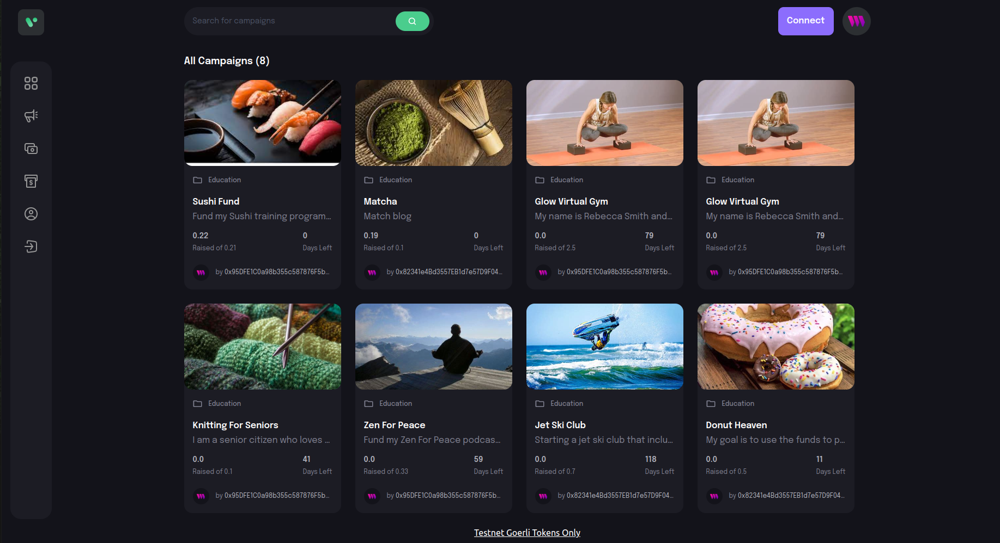

# Web3 Crowd Funding Application

### Still Being Developed...
 
This is a portfolio project showing experience with Soidity and UX/UI development.

## Screenshots:



## Built with:
Vite,
Thirdweb,
Solidity,
Ethers

## How to use:

```bash
cd display
yarn run dev
```

## Contribute:

Feel free to a fork the repo or notify me of any issues that are present

## Credit:

JavascriptMastery's tutorial helped me create this project:
https://www.youtube.com/watch?v=BDCT6TYLYdI&t=468s

## License:

MIT © BChainDev
